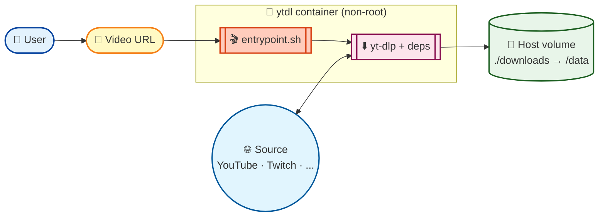

<div align="center">

# 🎬 ytdl

[](https://github.com/SimplicityGuy/ytdl/actions/workflows/build.yml)

[](https://github.com/SimplicityGuy/ytdl/pkgs/container/ytdl)

[](https://github.com/pre-commit/pre-commit)
[](https://github.com/hadolint/hadolint)
[](https://www.shellcheck.net/)
[](https://github.com/SimplicityGuy/ytdl/blob/main/.github/dependabot.yml)
[](https://claude.ai/code)

**A batteries-included Docker image for [yt-dlp](https://github.com/yt-dlp/yt-dlp) — every optional dependency pre-installed, multi-arch, rebuilt weekly so the downloader stays current.**

</div>

<p align="center">

[🚀 Quick Start](#-quick-start) | [🏛️ Architecture](#%EF%B8%8F-architecture) | [🌟 Key Features](#-key-features) | [📦 Image](#-image) | [🛠️ Development](#%EF%B8%8F-development) | [💬 Community](#-support--community)

</p>

## 🎯 What is ytdl?

`ytdl` packages [yt-dlp](https://github.com/yt-dlp/yt-dlp) with every optional system and Python dependency it can use — `ffmpeg`, `mpv`, `atomicparsley`, `rtmpdump`, `deno`, `curl_cffi`, `mutagen`, `pycryptodomex`, and more — so you do not have to build a host environment to download videos. One `docker run` and you have a working downloader that:

- merges video and audio streams, embeds thumbnails, and writes extended file attributes
- impersonates real browsers (Chrome / Edge / Safari) to avoid bot challenges
- supports HLS, DASH, RTMP, WebSocket, and JavaScript-extracted YouTube streams
- writes a `.info.json` metadata sidecar alongside every download

The image is published as multi-arch (`linux/amd64` + `linux/arm64`) and rebuilt every Saturday so the bundled `yt-dlp` stays current with upstream extractor fixes.

## 🚀 Quick Start

```bash
docker run --rm -v "$(pwd)/downloads:/data" \
  ghcr.io/simplicityguy/ytdl:latest \
  "https://www.youtube.com/watch?v=VIDEO_ID"
```

Downloads land in `./downloads`, organized by uploader:

```
downloads/<uploader>/<title>-<id>.<ext>
downloads/<uploader>/<title>-<id>.info.json
```

## 🏛️ Architecture



The container is single-shot: it boots, runs `yt-dlp` with our default options against the URL passed as argv, writes the result to `/data` as the non-root `ytdl` user, and exits. Mount a host directory to `/data` to persist downloads.

| Layer            | What it does                                                                                       |
| ---------------- | -------------------------------------------------------------------------------------------------- |
| **Base**         | `python:3-slim-trixie` — single stage, kept minimal                                                |
| **System deps**  | `ffmpeg`, `mpv`, `atomicparsley`, `rtmpdump`, `deno` (for `yt-dlp-ejs`)                            |
| **Python deps**  | `yt-dlp[default,curl-cffi]` + `xattr` (installed via `pip` on top of the base Python)              |
| **Entrypoint**   | `entrypoint.sh` — emoji-bearing wrapper that pins our default output template and metadata flags   |
| **User**         | Non-root `ytdl` (uid auto-assigned by `useradd`); workdir `/data`                                  |

## 🌟 Key Features

- **🐋 Multi-arch**: `linux/amd64` + `linux/arm64` — built with Docker Buildx, one image manifest for both
- **🔁 Weekly rebuilds**: scheduled Saturday cron picks up the latest `yt-dlp` so extractor fixes ship without manual intervention
- **🪪 OCI provenance**: full [`org.opencontainers.image.*`](https://github.com/opencontainers/image-spec/blob/main/annotations.md) labels, SLSA provenance, and SBOM attached to every push
- **🔒 Non-root by default**: runs as the `ytdl` user; host-mounted downloads land owned by your UID, not root
- **📦 Batteries included**: every yt-dlp optional dependency is pre-installed — no surprises mid-download
- **🤖 Dependabot-managed**: weekly grouped PRs for GitHub Actions and the Docker base image
- **🧪 Lint-gated CI**: `hadolint`, `shellcheck`, `shfmt`, `actionlint`, and `check-jsonschema` all enforced via pre-commit; the same hooks run locally and in CI
- **🛡️ Security scanning**: Anchore vulnerability scan on every build

## 📦 Image

Published to GitHub Container Registry as `ghcr.io/simplicityguy/ytdl`:

| Tag                | What                                                  |
| ------------------ | ----------------------------------------------------- |
| `latest`           | Latest build off `main`                               |
| `main`             | Same as `latest`                                      |
| `pr-<n>`           | Per-PR preview builds (not pushed for forks)          |
| `sha-<short>`      | Immutable, commit-pinned tag                          |
| `YYYYMMDD`         | Weekly scheduled rebuild — picks up the latest yt-dlp |

### What's inside

#### System packages

- **atomicparsley** — embed thumbnails in mp4/m4a files
- **ffmpeg** (includes ffprobe) — merge video/audio streams, post-processing
- **mpv** — RTSP/MMS stream playback
- **deno** (replaces nodejs) — JavaScript runtime for `yt-dlp-ejs`
- **rtmpdump** — RTMP stream downloads

#### Python packages

- **brotli** — Brotli content encoding support
- **certifi** — Mozilla root certificate bundle
- **curl_cffi** — browser impersonation (Chrome, Edge, Safari)
- **mutagen** — embed thumbnails in audio formats
- **pycryptodomex** — decrypt AES-128 HLS streams
- **requests** — HTTPS proxy and persistent connections
- **websockets** — websocket-based downloads
- **xattr** — write extended file attributes (metadata)
- **yt-dlp** — the downloader itself
- **yt-dlp-ejs** — full YouTube support via JavaScript extraction

### Inspecting OCI labels

```bash
docker inspect ghcr.io/simplicityguy/ytdl:latest \
  --format '{{json .Config.Labels}}' | jq
```

Notable labels: `org.opencontainers.image.{title,version,revision,created,source,licenses,base.name}` plus `com.simplicityguy.ytdl.{dependencies,python.version}`.

## 🛠️ Development

### Prerequisites

- Docker (with Buildx for multi-arch local builds)
- Python 3 + [pre-commit](https://pre-commit.com/) (`pip install pre-commit`)
- [hadolint](https://github.com/hadolint/hadolint) on PATH for the Dockerfile lint hook (`brew install hadolint` on macOS, or use [arkade](https://github.com/alexellis/arkade) — `arkade get hadolint`)

### One-time setup

```bash
git clone https://github.com/SimplicityGuy/ytdl.git
cd ytdl
pre-commit install
```

### Lint everything (matches CI exactly)

```bash
pre-commit run --all-files
```

The hooks cover:

- **hadolint** — Dockerfile lint
- **shellcheck** — bash static analysis (`--severity=warning`)
- **shfmt** — bash formatting (`--indent=2 --case-indent`, applied with `--write`)
- **actionlint** + **check-jsonschema** — GitHub Actions workflow + dependabot validation
- Standard hygiene: trailing whitespace, EOF newlines, merge-conflict markers, executable shebangs, private-key detection

### Build locally

```bash
docker build -t ytdl .
docker run --rm -v "$(pwd)/downloads:/data" ytdl "https://www.youtube.com/watch?v=VIDEO_ID"
```

### Build with full label metadata (mirrors CI)

```bash
docker build \
  --build-arg BUILD_DATE="$(date -u +'%Y-%m-%dT%H:%M:%SZ')" \
  --build-arg BUILD_VERSION="$(git describe --tags --always)" \
  --build-arg VCS_REF="$(git rev-parse HEAD)" \
  -t ytdl .
```

### CI/CD

| Workflow                                                          | Trigger                                 | Purpose                                                |
| ----------------------------------------------------------------- | --------------------------------------- | ------------------------------------------------------ |
| [`build.yml`](.github/workflows/build.yml)                         | push, PR, weekly cron, manual           | Lint → Anchore scan → multi-arch buildx → push to GHCR with provenance + SBOM |
| [`cleanup-cache.yml`](.github/workflows/cleanup-cache.yml)         | PR closed                               | Drop GitHub Actions caches scoped to the closed PR     |
| [`cleanup-images.yml`](.github/workflows/cleanup-images.yml)       | monthly cron (15th), manual             | Prune untagged + old GHCR images, keep last 5 tagged   |

Dependabot ([`.github/dependabot.yml`](.github/dependabot.yml)) opens grouped weekly PRs for `github-actions` and the `docker` base image.

See [CLAUDE.md](CLAUDE.md) for development conventions, architecture notes, and bug-prevention guidelines.

## 💬 Support & Community

- 🐛 **Bug Reports**: [GitHub Issues](https://github.com/SimplicityGuy/ytdl/issues)
- 💡 **Feature Requests**: [GitHub Discussions](https://github.com/SimplicityGuy/ytdl/discussions)
- 💬 **Questions**: [Discussions Q&A](https://github.com/SimplicityGuy/ytdl/discussions/categories/q-a)

For yt-dlp behaviour itself — extractor coverage, format selection, post-processing flags — please report upstream at [yt-dlp/yt-dlp](https://github.com/yt-dlp/yt-dlp/issues). This project only packages it.

## 📄 License

This project is licensed under the MIT License — see the [LICENSE](LICENSE) file for details.

## 🙏 Acknowledgments

- ⬇️ [yt-dlp](https://github.com/yt-dlp/yt-dlp) — the project this image exists to ship
- 🎞️ [FFmpeg](https://ffmpeg.org/), [mpv](https://mpv.io/), [AtomicParsley](https://github.com/wez/atomicparsley), [rtmpdump](https://rtmpdump.mplayerhq.hu/) — the system dependencies that make yt-dlp's optional features actually optional
- 🦕 [Deno](https://deno.com/) — JavaScript runtime used by `yt-dlp-ejs` for full YouTube support
- 🐍 The Python community — for `curl_cffi`, `mutagen`, `pycryptodomex`, `xattr`, and the rest of the stack

______________________________________________________________________

<div align="center">
Made with ❤️ in the Pacific Northwest
</div>
